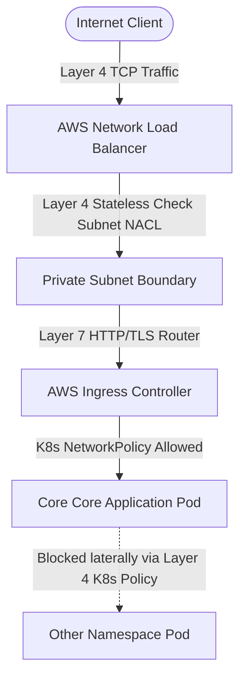

# AWS Platform Control Plane (`my-platform-control-plane`)

An enterprise-grade, zero-trust Internal Developer Platform (IDP) control plane built on AWS. This repository acts as the active orchestrator and declarative source of truth for underlying cloud infrastructure, multi-tenant Kubernetes environments, and automated security policies.

## 🏗️ Core Architecture Overview

This control plane transitions away from traditional infrastructure-as-code scripts into an active, tool-agnostic reconciliation engine. It is explicitly designed to handle strict multi-tenant boundary isolation and "shift-left" security compliance.

### 🛡️ Layer 4 vs. Layer 7 Network Security Model
The system enforces strict security boundaries across the OSI model layers:
*   **Layer 1 (Physical):** Offloaded entirely to the AWS Shared Responsibility Model (leveraging AWS compliance certifications).
*   **Layer 4 (Transport):** Enforced at the edge via **Stateless AWS Network ACLs (NACLs)** on private subnets, **Stateful AWS Security Groups** for explicit EKS node/pod communications, and cluster-level Kubernetes **NetworkPolicies** to prevent lateral pod-to-pod movement.
*   **Layer 7 (Application):** Managed via an **AWS ALB / NGINX Ingress Controller** handling secure TLS termination, path routing, and web application firewalls.



---

## 📂 Repository Structure

```text
my-platform-control-plane/
├── terraform/                # Layer 3/4 Infrastructure & Core Provisioning
│   ├── environments/         # Multi-account/env configuration (dev/prod clusters)
│   └── modules/              # Reusable infrastructure (hardened VPC & EKS)
├── kubernetes/               # Cluster-wide System-Level CRDs & Policies
│   ├── policies/             # Admission Controllers (OPA Gatekeeper/Kyverno)
│   └── network-policies/     # Pod-to-Pod Layer 4 security firewalls
├── gitops/                   # Declarative Automation & System Sync Engines
│   ├── platform-apps/        # Core platform services bootstrap (Ingress, Cert-Manager)
│   └── apps-delivery/        # Intent-driven application deployment specs
├── observability/            # Telemetry, VPC Flow Logs, & Security Auditing
├── applications/             # Hardened Mock Developer Microservices (Proof of Concept)
└── docs/                     # Architecture Decision Records (ADRs) & Strategy
```

---

## 🛠️ Architectural Trade-offs & Decisions

| Component | Technical Selection | Enterprise Justification |
| :--- | :--- | :--- |
| **Networking** | 3-Tier Private AWS VPC | Explicitly isolates the EKS Control Plane and private worker nodes from direct public exposure. |
| **GitOps Engine** | Abstract Manifest Patterns | Manifests are decoupled from the specific runner. While this iteration targets ArgoCD, the structure allows an immediate swap to alternate intent-driven engines (e.g., Flux or internal orchestrators) with zero manifest redesign. |
| **Security Automation**| Policy as Code (PaC) | Enforces compliance at code-review time via IaC linters and in-cluster via Kubernetes admission controllers. |

---

## 🚀 Local Engineering Sandbox Getting Started

*(Documentation to be populated continuously alongside DevSecOps curriculum implementation)*

---

## 📚 Upstream References & Continuing Education
To bridge enterprise infrastructure hardening with cloud-native telemetry, configurations and architectural designs within this control plane are developed in alignment with:
* **Infrastructure Layer:** Guided by the [TechWorld with Nana DevSecOps Enterprise Framework](https://techworld-with-nana.com).
* **Telemetry Layer:** Developed using design patterns adapted from Alex Boten's [*Cloud-Native Observability with OpenTelemetry*](https://github.com) repository, specifically focusing on Chapter 3 (Auto-Instrumentation) and Chapter 10 (Production Deployments).

